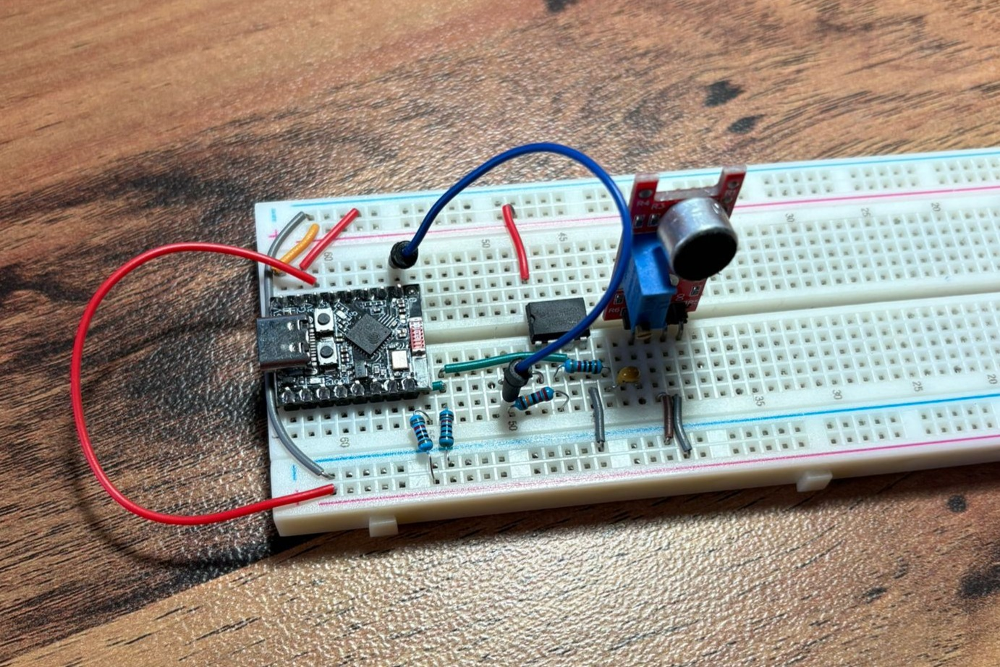
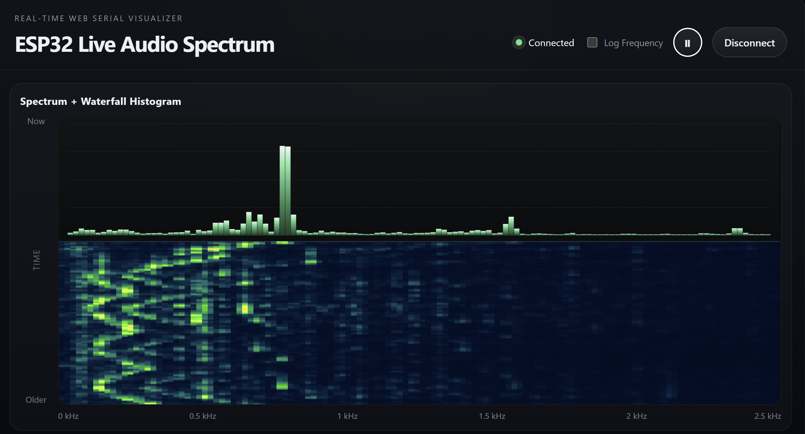
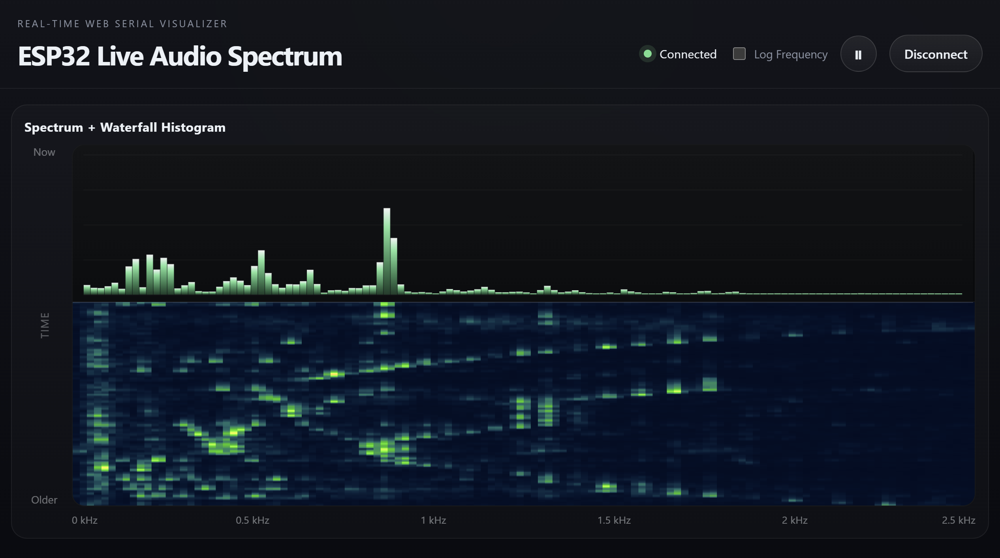

# ESP_FFT

Real-time audio spectrum visualizer using an ESP32‑C3 and a Web Serial visualizer.
Built on PlatformIO, using Github Copilot and Google Gemini.

## Project Summary

- Samples an audio input on the ESP32 ADC (512 samples, 10 kHz sampling) and computes a 512‑point FFT.
- Streams bin magnitudes over Serial in a simple Teleplot line format (`>Bin_#:value`) at 921600 baud.
- A browser front‑end (`web/index.html` + `web/script.js`) reads the serial stream using the Web Serial API and renders a live spectrum and waterfall.

## Architecture

- `firmware/src/AudioAnalyzer.cpp` / `firmware/include/AudioAnalyzer.h` — timer‑driven sampling ISR (double buffer), FFT using `arduinoFFT`, and a `sendToTeleplot()` method that prints `>Bin_n:value` lines to `Serial`.
- `firmware/src/main.cpp` — initializes `Serial` (921600) and the `AudioAnalyzer`, then in `loop()` waits for `audio.dataReady`, computes FFT, sends Teleplot output, and resumes sampling.
- `web/index.html`, `web/script.js`, `web/style.css` — Web UI that connects to the ESP32 via the browser Web Serial API, parses Teleplot lines, and draws spectrum + waterfall. See `web/script.js` for rendering details (linear/log axis option, waterfall palette).
- `platformio.ini` — build configuration (board: `esp32-c3-devkitm-1`, `arduinoFFT` dependency, custom firmware directories).

## Examples and Pictures

### Mozart:

### Dance of the bumblebee:

## Wiring

1. Audio input (to ADC)
   - Connect a conditioned, AC‑coupled audio signal to the ADC channel used by `analogRead(0)` on your ESP32‑C3 board.
   - The code subtracts 2048 to center samples, so provide a mid‑rail bias. Example bias circuit:

      - Two equal resistors (e.g., 100kΩ) between 3.3V and GND to create Vbias ≈ 1.65V.
      - Decouple Vbias with a 10 µF electrolytic (to GND) and a 100 nF ceramic to GND.
      - AC‑couple the audio source with a 1 µF non‑polarized capacitor into the biased node.
      - Optional series resistor (10 kΩ) between capacitor and ADC for protection.

   - IMPORTANT: Share ground between the audio source and the ESP32. Keep input amplitude small (avoid saturating the ADC). The code assumes 12‑bit ADC (0–4095) and centers by subtracting 2048.

2. Serial / USB
   - Connect the ESP32 to your computer via USB and open the Web Serial UI in a Chromium‑based browser (HTTPS or `localhost`).
   - Baud rate: `921600` (set in the UI and in `main.cpp`).

## License / Credits

This project uses `arduinoFFT` (kosme/arduinoFFT) as configured in `platformio.ini`.
